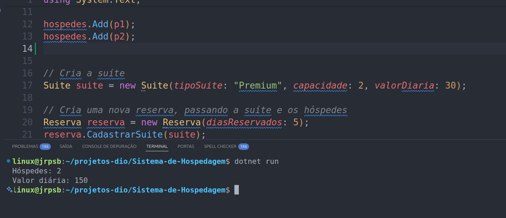
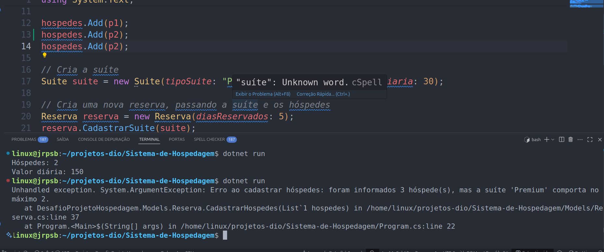

# 🏨 Sistema de Hospedagem - Projeto .NET C#

📚 **Desafio prático da DIO**  
🔗 Trilha: .NET - Explorando a Linguagem C#  
🌐 Plataforma: [dio.me](https://www.dio.me)

---

## 📖 Descrição do Desafio

Implementar um sistema de **reserva de hospedagem** com base em três entidades principais:

- `Pessoa`: representa um hóspede  
- `Suite`: representa o tipo e capacidade da suíte  
- `Reserva`: relaciona os hóspedes com uma suíte e aplica regras de negócio  

O objetivo é construir um programa funcional que simule o processo de reserva, considerando validações, cálculo de valor da estadia e desconto automático.

---

## ✅ Regras de Negócio

1. **Capacidade da suíte:**  
   A quantidade de hóspedes **não pode exceder** a capacidade da suíte.  
   → Caso isso ocorra, deve lançar uma `ArgumentException`.

2. **Quantidade de hóspedes:**  
   O método `ObterQuantidadeHospedes()` da classe `Reserva` deve retornar o número exato de hóspedes cadastrados.

3. **Cálculo da diária:**  
   O método `CalcularValorDiaria()` deve calcular o valor total da hospedagem da seguinte forma:

```csharp
valorTotal = DiasReservados * ValorDiaria;

if (DiasReservados >= 10)
{
    valorTotal *= 0.9m; // aplica 10% de desconto
}
```


## 🧱 Estrutura do Projeto

```bash
Sistema-de-Hospedagem/
├── Models/
│   ├── Pessoa.cs           # Classe do hóspede
│   ├── Suite.cs            # Classe da suíte
│   └── Reserva.cs          # Classe principal com validações e cálculos
├── imagens/
│   ├── diagrama-classe.png # Diagrama UML do sistema
│   ├── print-entrada.png   # Entrada no terminal
│   ├── print_saida.png     # Resultado do cálculo
│   └── print_erro.png      # Validação de erro (capacidade excedida)
├── Program.cs              # Execução principal com exemplo real
├── Sistema-de-Hospedagem.csproj
└── README.md
```

## 🧾 Diagrama UML do Sistema


---

## Prints do Sistema

### Entrada de Dados



### Saída do Sistema



---

## ▶️ Como Executar o Projeto

1. Clone o repositório:
   ```bash
   git clone https://github.com/seu-usuario/Sistema-de-Hospedagem.git

2. Navegue até o diretório:
   cd Sistema-de-Hospedagem

3. Execute o projeto com o .NET CLI:
   dotnet run


## 🛠️ Tecnologias Utilizadas

- C#
- .NET 6
- VS Code ou Visual Studio

